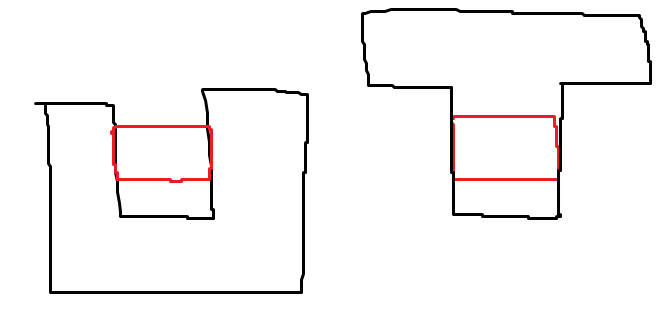

# Polygon intersection helper

This algorithm finds if two polygons intersect. For the intersection to exist, the intersection area must be > 0. In other words, their interiors must intersect. For example, the black and red polygons do not intersect in the first case, and intersect in the second:

