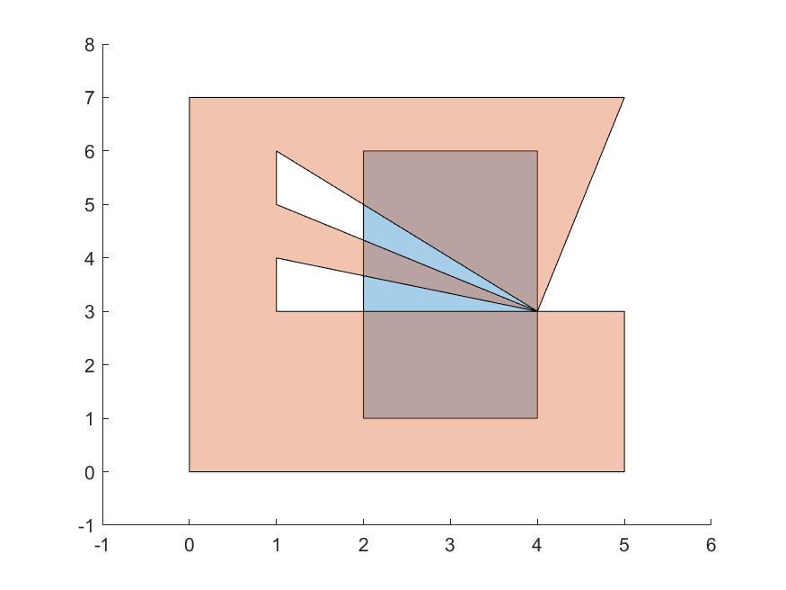

# Polygon intersection helper

This module has an algorithm to check if two simple polygons intersect, and another to find the intersection polygons. 


## Definition of intersection ##
For an intersection to exist, the intersection area must be > 0. In other words, the polygon interiors must intersect. For example, the orange and blue polygons do not intersect in the first case, but intersect in the second:

⠀ | ⠀ |
|:-------------------------:|:-------------------------:|
 | 

For more examples, check below the table of tests each algortihm was submitted to.


## How the algorithms work ##
The algorithm to check if the intersection exists was based on the observation that an intersection occurs if one of the following criteria is fulfilled:
1. An edge of one polygon crosses an edge of the other;
2. A point of one polygon lies inside the other;
3. A point of one polygon lies on an edge of the other, in such a way that the interior of the point's corner intersects the interior of the other polygon;

The algorithm to find the intersection polygons was then designed to apply these three tests in an iterative fashion and save the points it considers to be part of the intersection polygon.


## How to use them ##
To use each algorithm, both polygons must be arrays of 2D point coordinates, ordered counter-clockise. Then, they may be called like:

```
const polygon1 = [[0,0],[1,0],[1,1],[0,1]];
const polygon2 = [[0,-1],[2,0.5],[0,2]];
const polygonsIntersect = checkIfPolygonsIntersect(polygon1, polygon2);
const intersectionPolygons = findIntersectionBetweenPolygons(polygon1, polygon2);
```


## Validation tests ##
⠀ | ⠀ | ⠀ | ⠀ |
|:-------------------------:|:-------------------------:|:-------------------------:|:-------------------------:|
 Test 01. Intersection: true |   Test 02. Intersection: true |  Test 03. Intersection: false |  Test 04. Intersection: true
 Test 05. Intersection: true |   Test 06. Intersection: false |  Test 07. Intersection: false |  Test 08. Intersection: true
 Test 09. Intersection: false |   Test 10. Intersection: true |  Test 11. Intersection: false  |  Test 12. Intersection: true
 Test 13. Intersection: true |   Test 14. Intersection: true |  Test 15. Intersection: true  |  Test 16. Intersection: true
 Test 17. Intersection: true |  Test 18. Intersection: true 

