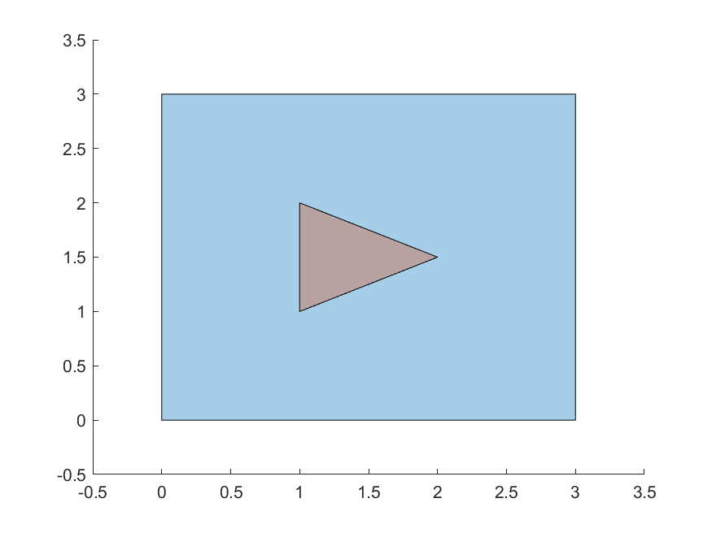

# Polygon intersection helper

This algorithm checks and finds the intersection of two simple polygons. For the intersection to exist, the intersection area must be > 0. In other words, their interiors must intersect. 

For example, the black and red polygons do not intersect in the first case, but intersect in the second:


Both polygons must be arrays of 2D point coordinates, ordered counter-clockwise. In principle, the algorithm should work on non-simple polygons with holes, it just needs to be adapted to accept variables representing such polygons (such as an array with an array for each polygon border).

To check if the intersection exists, you may call `checkIfPolygonsIntersect()`, and to find the intersection polygons, call `findIntersectionBetweenPolygons()`, like:

```
const polygon1 = [[0,0],[1,0],[1,1],[0,1]];
const polygon2 = [[0,-1],[2,0.5],[0,2]];
const polygonsIntersect = checkIfPolygonsIntersect(polygon1, polygon2);
const intersectionPolygons = findIntersectionBetweenPolygons(polygon1, polygon2);
```

Here are more tests either functions passed:
⠀ | ⠀ | ⠀ | ⠀ |
|:-------------------------:|:-------------------------:|:-------------------------:|:-------------------------:|
 Test 01. Intersection: true |   Test 02. Intersection: true |  Test 03. Intersection: false |  Test 04. Intersection: true
 Test 05. Intersection: true |   Test 06. Intersection: false |  Test 07. Intersection: false |  Test 08. Intersection: true
 Test 09. Intersection: false |   Test 10. Intersection: true |  Test 11. Intersection: false  |  Test 12. Intersection: true
 Test 13. Intersection: true |   Test 14. Intersection: true |  Test 15. Intersection: true  |  Test 16. Intersection: true

